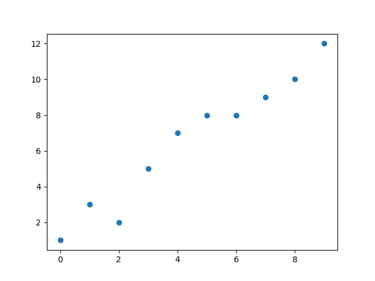
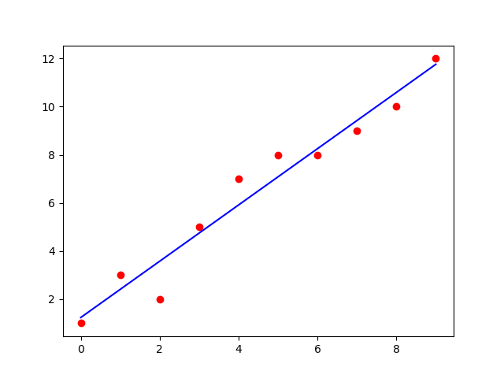

# Implementation of Univariate Linear Regression
## Aim:
To implement univariate Linear Regression to fit a straight line using least squares.
## Equipment’s required:
1.	Hardware – PCs
2.	Anaconda – Python 3.7 Installation / Moodle-Code Runner
## Algorithm:
1.	Get the independent variable X and dependent variable Y.
2.	Calculate the mean of the X -values and the mean of the Y -values.
3.	Find the slope m of the line of best fit using the formula.
 
4.	Compute the y -intercept of the line by using the formula:
  
5.	Use the slope m and the y -intercept to form the equation of the line.
6.	Obtain the straight line equation Y=mX+b and plot the scatterplot.
## Program
        '''Developed By:Maha shree.M
        Register No:24900438
        ''' 

        import numpy as np
        import matplotlib.pyplot as plt

        # Input data (X and Y)
        x = np.array([1, 2, 3, 4, 5, 6])
        y = np.array([1, 3, 5, 7, 9, 12])

        # Scatter plot of the data
        plt.scatter(x, y)
        plt.xlabel('X-axis')
        plt.ylabel('Y-axis')
        plt.title('Scatter Plot of X and Y')

        # Calculating mean of X and Y
        xmean = np.mean(x)
        ymean = np.mean(y)

        # Calculating slope (m) and intercept (b) for y = mx + b
        num = 0  # Numerator
        den = 0  # Denominator
        for i in range(len(x)):
            num += (x[i] - xmean) * (y[i] - ymean)
            den += (x[i] - xmean) ** 2

        m = num / den  # Slope
        b = ymean - m * xmean  # Intercept

        # Printing the slope and intercept
        print("Slope (m):", m)
        print("Intercept (b):", b)

        # Predicting values using the line equation
        ypred = m * x + b
        print("Predicted Y values:", ypred)

        # Plotting the regression line and data points
        plt.scatter(x, y, color='Red', label='Data points')
        plt.plot(x, ypred, color='Blue', label='Regression line')
        plt.legend()

        # Displaying the plot
        plt.show()

## Output

## Result
Thus the univariate Linear Regression was implemented to fit a straight line using least squares.
